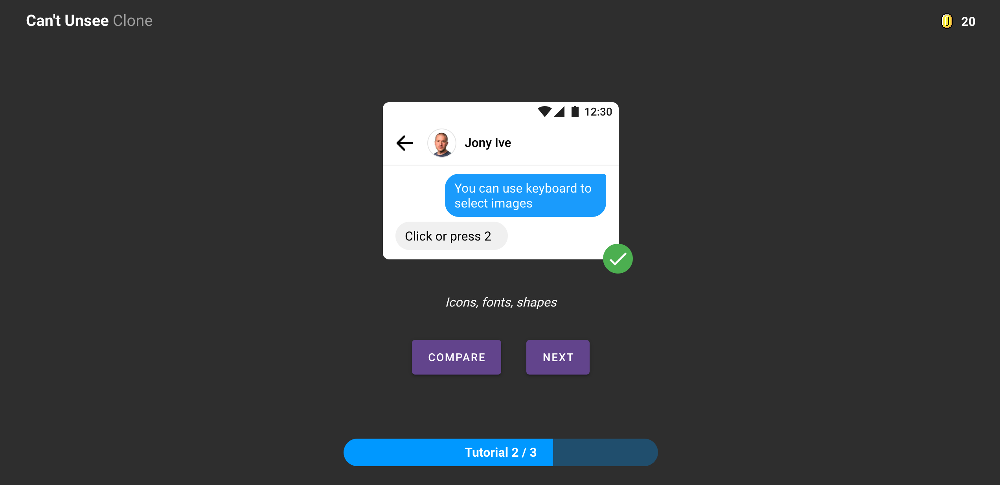

# Can't Unsee Clone

Un clone du site (et jeu) Can't Unsee, développé en VueJS et Vuetify.



- **Nature :** projet personel
- **Date :** février 2020
- **Description :** il s'agit d'un clone de site (et jeu) Can't Unsee, développé en VueJS

## Technologies utilisées

- VueJS
- Javascript
- CSS
- HTML

## Versions

- **1.0.0 :**
    - **Fonctionnalités :** le joueur peut sélectionner une réponse et par la suite la comparer avec une autre. Chaque bonne réponse est gratifiée d'un nombre de points gagnés (dépendant du niveau). Lorsque le joueur a terminé de jouer, il peut voir son score total ainsi que son temps de jeu
    - **Temps de réalisation :** environ 2 jours

## Installation du projet (NPM)

```
npm install
npm run serve
```
